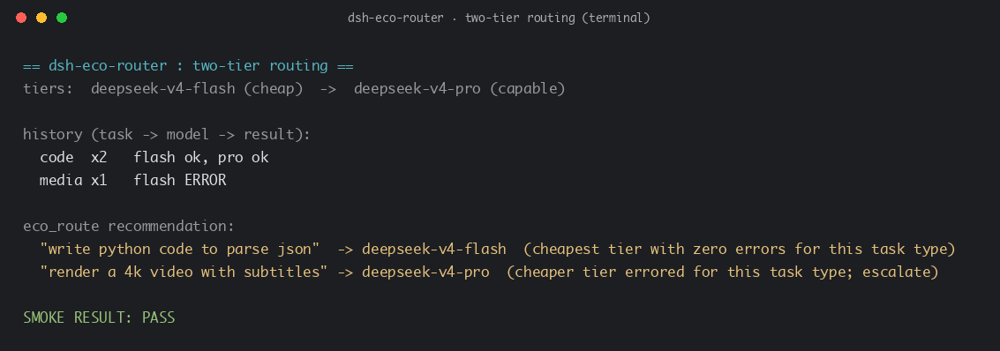

# dsh-eco-router

[DeepSeek Harness](https://github.com/deepseek-ai/deepseek-harness) 的 **token 高效模型路由飞轮**。

它把 OpenSquilla 的核心思想——*"同样的预算，更强的能力（same budget, more capability）"*——做成一个自改进路由循环：观测每一轮的 **（任务 → 模型 → 结果）**，按任务类别蒸馏出一张带**逐模型错误计数**的路由表，持久化到 `eco_router.json`，并暴露一个 `eco_route` 工具，把每个任务路由到历史上成功过的最便宜模型档位。

> [English](README.md)

## 真实验证截图



（真实加载构建产物 `lib/index.js`，以两个模型档位验证：一个 `code` 任务在 `deepseek-v4-flash` 上成功、一个 `media` 任务在 flash 上失败后，`eco_route` 把 `code` 任务路由到便宜档 `deepseek-v4-flash`、把 `media` 任务升级到强档 `deepseek-v4-pro`。）

## 它做了什么

| 阶段 | 实现 |
| --- | --- |
| 观测**任务** | `agent/inbox/claimed` → 用户消息文本 + 粗分类（`media` / `code` / `research` / `documents` / `comm` / `general`） |
| 观测**模型** | `agent/request` 瀑布 → 每步实际路由的 `{ provider, model }` |
| 观测**结果** | `tools/result`（工具名 + `isError`）与 `agent/error` |
| 蒸馏 | 按类别聚合 `{ turns, errors, models: { model: { uses, errors } } }` |
| 持久化 | 每轮结束把路由表写入 `eco_router.json` |
| 推荐 | `eco_route` → 该任务类型下零错误的最便宜档位 |
| 路由（可选） | `autoRoute: true` 时还会在 `agent/request` 直接覆盖所路由的模型 |

所有监听器都挂在发起 agent 的**作用域上下文**（`agent.ctx.on(...)`）上——与 harness 自带 `installModelSelection` 相同的模式，因此只观测该 agent 自身的流量。

## 目录结构

```
dsh-eco-router/
├── src/index.ts           # 插件实现：name / inject / Config / apply
├── preset/
│   ├── agent.cordis.yml   # 引用本包的组合示例
│   └── preset.yml         # preset 显示元数据
├── docs/verify.png        # 真实构建验证截图
├── package.json
├── tsconfig.json
├── tsdown.config.ts
├── README.md              # 英文文档
└── README.zh.md           # 本文档
```

## 前置条件

> ⚠️ **依赖状态** —— 本插件依赖的 `@deepseek-ai/*` 包（`@deepseek-ai/cordis`、`@deepseek-ai/schemastery`、`@deepseek-ai/dsh-agent`、`@deepseek-ai/dsh-fs`、`@deepseek-ai/dsh-llm`、`@deepseek-ai/dsh-tools`）**尚未发布到 npm**，它们是 [deepseek-harness](https://github.com/deepseek-ai/deepseek-harness) monorepo 的 `workspace:` 内部包。在仓库之外直接 `npm install` 会解析失败。

目前要构建，二选一：

- **在 harness monorepo 内构建** —— 把本包放进 `packages/`（或作为 workspace 引入），让 `@deepseek-ai/*` 以 workspace 包形式解析；
- **等上游发布** —— 待 `@deepseek-ai/*` 上 npm 后，锁定 `peerDependencies` 版本再正常安装。

## 构建

```bash
npm install
npm run build          # tsdown → lib/index.js + lib/index.d.ts
```

`@deepseek-ai/dsh-*` 是 `peerDependencies`；请与它们一起安装（或在 DeepSeek Harness 开发环境内以 workspace 包构建）。

## 挂载（作为 preset）

把本目录复制到你的用户 preset 根目录并挂载，或在自己的组合里加一行：

```yaml
- id: dsh-eco-router
  name: '@joyfoxai/dsh-eco-router'
  config:
    tiers: [deepseek-v4-flash, deepseek-v4-pro]   # 从便宜到贵
    autoRoute: false                               # true → 在 agent/request 直接覆盖
```

- `tiers` —— 有序模型 id，最便宜在前。`eco_route` 推荐该任务类型下无错误记录的最便宜档位。
- `autoRoute` —— 为 `true` 时，插件会在 `agent/request` 瀑布里直接覆盖所路由的模型（而不只是推荐）。

插件只注入宿主服务（`agents`、`fs`、`tools`），自身不发布任何服务，因此这一行直接平铺即可，无需 isolate 域。

## 开源 / 发布

1. `npm publish`（scope `@joyfoxai`，`access: public`）。
2. 用户安装后在 `agent.cordis.yml` 里按名字引用。

本包源自一个动态 Cordis Plugin（`cordis_define`），那种形态**仅进程内、不可分发**；这个包才是可发布的形态。

## License

MIT
